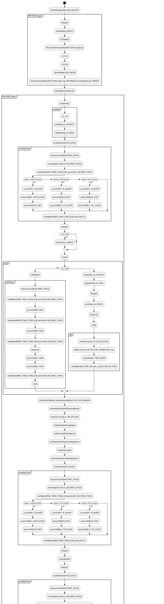

## BasicSender程式流程

```plantuml
@startuml
start
:DW1000.begin(PIN_IRQ, PIN_RST);
partition DW1000.begin{
    :delay(5);
    :pinMode(irq, INPUT);
    :SPI.begin();
    :SPI.usingInterrupt(digitalPinToInterrupt(irq));
    :_rst=rst;
    :_irq=irq;
    :_deviceMode=IDLE_MODE;
    :attachInterrupt(digitalPinToInterrupt(_irq), DW1000Class::handleInterrupt, RISING);
}
:DW1000.select(PIN_SS);
partition DW1000.select{
    :reselect(ss);
    partition reselect{
        :_ss = ss;
        :pinMode(_ss, OUTPUT);
        :digitalWrite(_ss, HIGH);
    }
    :enableClock(AUTO_CLOCK);
    partition enableClock{
        :byte pmscctrl0[LEN_PMSC_CTRL0];
        :memset(pmscctrl0, 0, LEN_PMSC_CTRL0);
        :readBytes(PMSC, PMSC_CTRL0_SUB, pmscctrl0, LEN_PMSC_CTRL0);
        if (clock == AUTO_CLOCK) then (yes)
        :_currentSPI = &_fastSPI;
        :pmscctrl0[0] = AUTO_CLOCK;
        :pmscctrl0[1] &= 0xFE;
        elseif (clock == XTI_CLOCK) then (yes)
        :_currentSPI = &_slowSPI;
        :pmscctrl0[0] &= 0xFC;
        :pmscctrl0[0] |= XTI_CLOCK;
        elseif (clock == PLL_CLOCK) then (yes)
        :_currentSPI = &_fastSPI;
        :pmscctrl0[0] &= 0xFC;
        :pmscctrl0[0] |= PLL_CLOCK;
        endif
        :writeBytes(PMSC, PMSC_CTRL0_SUB, pmscctrl0, 2);
    }
    :delay(5);
    if(_rst != 0xff) then(yes)
        :pinMode(_rst, INPUT);
    endif
    :reset();
    partition reset{
        if(_rst != 0xff) then(yes)
            :softReset();
            partition softReset{
                :byte pmscctrl0[LEN_PMSC_CTRL0];
                :readBytes(PMSC, PMSC_CTRL0_SUB, pmscctrl0, LEN_PMSC_CTRL0);
                :pmscctrl0[0] = 0x01;
                :writeBytes(PMSC, PMSC_CTRL0_SUB, pmscctrl0, LEN_PMSC_CTRL0);
                :pmscctrl0[3] = 0x00;
                :writeBytes(PMSC, PMSC_CTRL0_SUB, pmscctrl0, LEN_PMSC_CTRL0);
                :delay(10);
                :pmscctrl0[0] = 0x00;
                :pmscctrl0[3] = 0xF0;
                :writeBytes(PMSC, PMSC_CTRL0_SUB, pmscctrl0, LEN_PMSC_CTRL0);
                :idle();
            }
        else
            :pinMode(_rst, OUTPUT);
            :digitalWrite(_rst, LOW);
            :delay(2);
            :pinMode(_rst, INPUT);
            :delay(10);
            :idle();
            partition idle{
                :memset(_sysctrl, 0, LEN_SYS_CTRL);
                :setBit(_sysctrl, LEN_SYS_CTRL, TRXOFF_BIT, true);
                :_deviceMode = IDLE_MODE;
                :writeBytes(SYS_CTRL, NO_SUB, _sysctrl, LEN_SYS_CTRL);
            }
        endif
    }
    :writeValueToBytes(_networkAndAddress, 0xFF, LEN_PANADR);
    :writeNetworkIdAndDeviceAddress();
    :memset(_syscfg, 0, LEN_SYS_CFG);
    :setDoubleBuffering(false);
    :setInterruptPolarity(true);
    :writeSystemConfigurationRegister();
    :clearInterrupts();
    :writeSystemEventMaskRegister();
    :enableClock(XTI_CLOCK);]
    partition enableClock{
        :byte pmscctrl0[LEN_PMSC_CTRL0];
        :memset(pmscctrl0, 0, LEN_PMSC_CTRL0);
        :readBytes(PMSC, PMSC_CTRL0_SUB, pmscctrl0, LEN_PMSC_CTRL0);
        if (clock == AUTO_CLOCK) then (yes)
        :_currentSPI = &_fastSPI;
        :pmscctrl0[0] = AUTO_CLOCK;
        :pmscctrl0[1] &= 0xFE;
        elseif (clock == XTI_CLOCK) then (yes)
        :_currentSPI = &_slowSPI;
        :pmscctrl0[0] &= 0xFC;
        :pmscctrl0[0] |= XTI_CLOCK;
        elseif (clock == PLL_CLOCK) then (yes)
        :_currentSPI = &_fastSPI;
        :pmscctrl0[0] &= 0xFC;
        :pmscctrl0[0] |= PLL_CLOCK;
        endif
        :writeBytes(PMSC, PMSC_CTRL0_SUB, pmscctrl0, 2);
    }
    :delay(5);
    :manageLDE();
    :delay(5);
    :enableClock(AUTO_CLOCK);
    partition enableClock{
        :byte pmscctrl0[LEN_PMSC_CTRL0];
        :memset(pmscctrl0, 0, LEN_PMSC_CTRL0);
        :readBytes(PMSC, PMSC_CTRL0_SUB, pmscctrl0, LEN_PMSC_CTRL0);
        if (clock == AUTO_CLOCK) then (yes)
        :_currentSPI = &_fastSPI;
        :pmscctrl0[0] = AUTO_CLOCK;
        :pmscctrl0[1] &= 0xFE;
        elseif (clock == XTI_CLOCK) then (yes)
        :_currentSPI = &_slowSPI;
        :pmscctrl0[0] &= 0xFC;
        :pmscctrl0[0] |= XTI_CLOCK;
        elseif (clock == PLL_CLOCK) then (yes)
        :_currentSPI = &_fastSPI;
        :pmscctrl0[0] &= 0xFC;
        :pmscctrl0[0] |= PLL_CLOCK;
        endif
        :writeBytes(PMSC, PMSC_CTRL0_SUB, pmscctrl0, 2);
    }
    :delay(5);
    :byte buf_otp[4];
    :readBytesOTP(0x008, buf_otp); // the stored 3.3 V reading
    :_vmeas3v3 = buf_otp[0];
    :readBytesOTP(0x009, buf_otp); // the stored 23C reading
    :_tmeas23C = buf_otp[0];
}
:DW1000.newConfiguration();
partition DW1000.newConfiguration{
    :idle();
    :readNetworkIdAndDeviceAddress();
    :readSystemConfigurationRegister();
    :readChannelControlRegister();
    :readTransmitFrameControlRegister();
    :readSystemEventMaskRegister();
}
:DW1000.setDefaults();
partition DW1000.setDefaults{
    if(_deviceMode == IDLE_MODE) then (yes)
        :useExtendedFrameLength(false);
        :useSmartPower(false);
        :suppressFrameCheck(false);
        :setFrameFilter(false);
        :interruptOnSent(true);
        :interruptOnReceived(true);
        :interruptOnReceiveFailed(true);
        :interruptOnReceiveTimestampAvailable(false);
        :interruptOnAutomaticAcknowledgeTrigger(true);
        :setReceiverAutoReenable(true);
        :enableMode(MODE_LONGDATA_RANGE_LOWPOWER);
    endif
}
:DW1000.setDeviceAddress(5);
:DW1000.setNetworkId(10);
:DW1000.enableMode(DW1000.MODE_LONGDATA_RANGE_LOWPOWER);
partition enableMode{
    :setDataRate(mode[0]);
    :setPulseFrequency(mode[1]);
    :setPreambleLength(mode[2]);
    :setChannel(CHANNEL_3);
    if (mode[1] == TX_PULSE_FREQ_16MHZ) then(yes)
        :setPreambleCode(PREAMBLE_CODE_16MHZ_4);
    else
        :setPreambleCode(PREAMBLE_CODE_64MHZ_10);
    endif
}
:DW1000.commitConfiguration();
partition commitConfiguration{
    note right:write all configurations back to device
    :writeNetworkIdAndDeviceAddress();
    :writeSystemConfigurationRegister();
    :writeChannelControlRegister();
    :writeTransmitFrameControlRegister();
    :writeSystemEventMaskRegister();
    note right:tune according to configuration
    :tune();
    note right:TODO clean up code + antenna delay/calibration API
    :note right:TODO setter + check not larger two bytes integer
    :byte antennaDelayBytes[LEN_STAMP];
    :writeValueToBytes(antennaDelayBytes, _antennaDelayValue,    :LEN_STAMP);
    :antennaDelay.setTimestamp(antennaDelayBytes);
    :writeBytes(TX_ANTD, NO_SUB, antennaDelayBytes, LEN_TX_ANTD);
    :writeBytes(LDE_IF, LDE_RXANTD_SUB, antennaDelayBytes, LEN_LDE_RXANTD);
}
:DW1000.attachSentHandler(handleSent);
partition attachSentHandler{
    :_handleSent = handleSent;
}
partition handleSent{
    :sentAck = true;
}
:transmitter();
partition transmitter{
    :DW1000.newTransmit();
    partition newTransmit{
        :idle();
        :memset(_sysctrl, 0, LEN_SYS_CTRL);
        :clearTransmitStatus();
        :_deviceMode = TX_MODE;
    }
    :DW1000.setDefaults();
    :String msg = "Hello DW1000, it's #"; msg += sentNum;
    :DW1000.setData(msg);
    partition setData{
        if (_frameCheck) then(yes)
            :n += 2;
        endif
        if (n > LEN_EXT_UWB_FRAMES) then (yes)
            end
        endif
        if (n > LEN_UWB_FRAMES && !_extendedFrameLength) then (yes)
            end
        endif
        :writeBytes(TX_BUFFER, NO_SUB, data, n);
        :_txfctrl[0] = (byte)(n & 0xFF);
        note right:1 byte (regular length + 1 bit);
        :_txfctrl[1] &= 0xE0;
        :_txfctrl[1] |= (byte)((n >> 8) & 0x03);
        note right:2 added bits if extended length
    }
    note right: rightdelay sending the message for the given amount
    :DW1000Time deltaTime = DW1000Time(10, DW1000Time::MILLISECONDS);
    :DW1000.setDelay(deltaTime);
    partition setDelay{
        if (_deviceMode == TX_MODE) then(yes)
            :setBit(_sysctrl, LEN_SYS_CTRL, TXDLYS_BIT, true);
        else if (_deviceMode == RX_MODE) then(yes)
            :setBit(_sysctrl, LEN_SYS_CTRL, RXDLYS_BIT, true);
        else
            :return DW1000Time();
        endif
        :byte delayBytes[5];
        :DW1000Time futureTime;
        :getSystemTimestamp(futureTime);
        :futureTime += delay;
        :futureTime.getTimestamp(delayBytes);
        :delayBytes[0] = 0;
        :delayBytes[1] &= 0xFE;
        :writeBytes(DX_TIME, NO_SUB, delayBytes, LEN_DX_TIME);
        note right:adjust expected time with configured antenna delay
        :futureTime.setTimestamp(delayBytes);
        :futureTime += _antennaDelay;
        :return futureTime;
    }
    :DW1000.startTransmit();
    :delaySent = millis();
}
while(true) is (yes)
    if (sentAck == false) then(yes)
        end
    endif
    :sentAck = false;
    :DW1000Time newSentTime;
    :DW1000.getTransmitTimestamp(newSentTime);
    partition getTransmitTimestamp{
        :byte txTimeBytes[LEN_TX_STAMP];
        :readBytes(TX_TIME, TX_STAMP_SUB, txTimeBytes, LEN_TX_STAMP);
        :time.setTimestamp(txTimeBytes);
        note right:DW1000Time &time
    }
    :sentTime = newSentTime;
    :sentNum++;
    :transmitter();
endwhile
end
@enduml
```