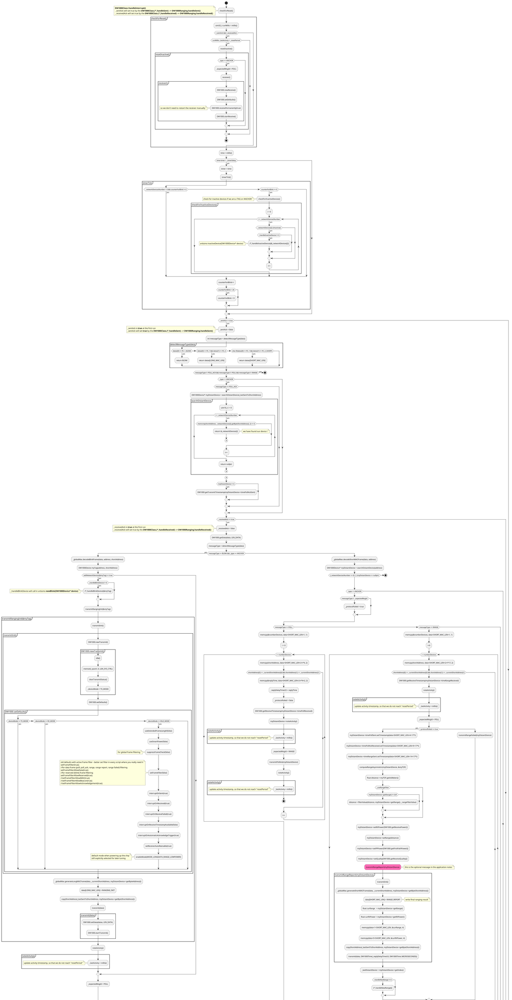

```plantuml
@startuml
scale max 4320 height
start
:checkForReset();
note left
<b>DW1000Class::handleInterrupt()</b>
 _sentAck will set true by the <b>DW1000Class.(*_handleSent) --> DW1000Ranging.handleSent()</b>
 _receivedAck will set true by the <b>DW1000Class.(*_handleReceived) --> DW1000Ranging.handleReceived()</b>
end note
partition checkForReset(){
    :uint32_t curMillis = millis();
    if(!_sentAck && !_receivedAck) then (yes)
        if(curMillis-_lastActivity > _resetPeriod) then (yes)
            :resetInactive();
            partition resetInactive(){
                if(_type == ANCHOR) then (yes)
                    :_expectedMsgId = POLL;
                    :receiver();
                    partition receiver(){
                        :DW1000.newReceive();
                        :DW1000.setDefaults();
                        :DW1000.receivePermanently(true);
                        note left:so we don't need to restart the receiver manually
                        :DW1000.startReceive();
                    }
                endif
            }
        endif
        stop
    endif
}
:time = millis();
if(time-timer > _timerDelay) then (yes)
    :timer = time;
    :timerTick();
    partition timerTick{
        if(_networkDevicesNumber > 0 && counterForBlink != 0) then(yes)
        elseif(counterForBlink == 0) then(yes)
            :checkForInactiveDevices();
            note left:check for inactive devices if we are a TAG or ANCHOR
            partition checkForInactiveDevices(){
                :i = 0;
                while (i < _networkDevicesNumber) is (yes)
                    if(_networkDevices[i].isInactive()) then (yes)
                        if(_handleInactiveDevice != 0) then (yes)
                            :(*_handleInactiveDevice)(&_networkDevices[i]);
                            note left:arduino inactiveDevice(DW1000Device* device)
                        endif
                    endif
                    :i++;
                endwhile
            }
        endif
        :counterForBlink++;
        if(counterForBlink > 20) then (yes)
            :counterForBlink = 0;
        endif
    }
endif
if(_sentAck == true) then(yes)
    :_sentAck = false;
    note left
     _sentAck is **true** at the first run
     _sentAck will set **true** by the <b>DW1000Class.(*_handleSent) --> DW1000Ranging.handleSent()</b>
    end note
    :int messageType = detectMessageType(data);
    partition detectMessageType(data){
        if(datas[0] == FC_1_BLINK) then (yes)
            :return BLINK;
        elseif(datas[0] == FC_1 && datas[1] == FC_2) then (yes)
            :return datas[LONG_MAC_LEN];
        elseif(else if(datas[0] == FC_1 && datas[1] == FC_2_SHORT)) then (yes)
            :return datas[SHORT_MAC_LEN];
        endif
    }
    if(messageType != POLL_ACK && messageType != POLL && messageType != RANGE) then (yes)
        stop
    endif
    if(_type == ANCHOR) then (yes)
        if(messageType == POLL_ACK) then (yes)
            :DW1000Device* myDistantDevice = searchDistantDevice(_lastSentToShortAddress);
            partition searchDistantDevice{
                :uint16_t i = 0;
                while (i < _networkDevicesNumber) is (yes)
                    if(memcmp(shortAddress, _networkDevices[i].getByteShortAddress(), 2) == 0)
                        :return &_networkDevices[i];
                        note right:we have found our device !
                        (a)
                        detach
                    endif
                    :i++;
                endwhile
                :return nullptr;
                (a)
                detach
            }
            (a)
            if (myDistantDevice != 0) then (yes)
                :DW1000.getTransmitTimestamp(myDistantDevice->timePollAckSent);
            endif
        endif
endif
if(_receivedAck == true) then(yes)
    :_receivedAck = false;
    note left
     _receivedAck is **true** at the first run
     _receivedAck will set true by the <b>DW1000Class.(*_handleReceived) --> DW1000Ranging.handleReceived()</b>
    end note
    :DW1000.getData(data, LEN_DATA);
    :messageType = detectMessageType(data);
    if(messageType == BLINK && _type == ANCHOR) then(yes)
        :_globalMac.decodeBlinkFrame(data, address, shortAddress);
        :DW1000Device myTag(address, shortAddress);

        if(addNetworkDevices(&myTag) == true) then(yes)
            if(_handleBlinkDevice != 0) then (yes)
                :(*_handleBlinkDevice)(&myTag);
                note left: _handleBlinkDevice will call in arduino <b>newBlink(DW1000Device* device)</b>
            endif
            :transmitRangingInit(&myTag);
            partition transmitRangingInit(&myTag) {
                :transmitInit();
                partition transmitInit(){
                    :DW1000.newTransmit();
                    partition DW1000.newTransmit(){
                        :idle();
                        :memset(_sysctrl, 0, LEN_SYS_CTRL);
                        :clearTransmitStatus();
                        :_deviceMode = TX_MODE;
                    }
                    :DW1000.setDefaults();
                    partition DW1000.setDefaults(){
                        if(_deviceMode == TX_MODE) then(yes)
                        elseif(_deviceMode == RX_MODE) then(yes)
                        elseif(_deviceMode == IDLE_MODE) then(yes)
                            :useExtendedFrameLength(false);
                            :useSmartPower(false);
                            :suppressFrameCheck(false);
                            note left : for global frame filtering
                            :setFrameFilter(false);
                            note left
                                old defaults with active frame filter - better set filter in every script where you really need it
                                setFrameFilter(true);
                                //for data frame (poll, poll_ack, range, range report, range failed) filtering
                                setFrameFilterAllowData(true);
                                //for reserved (blink) frame filtering
                                setFrameFilterAllowReserved(true);
                                //setFrameFilterAllowMAC(true);
                                //setFrameFilterAllowBeacon(true);
                                //setFrameFilterAllowAcknowledgement(true);
                            end note
                            :interruptOnSent(true);
                            :interruptOnReceived(true);
                            :interruptOnReceiveFailed(true);
		                    :interruptOnReceiveTimestampAvailable(false);
		                    :interruptOnAutomaticAcknowledgeTrigger(true);
		                    :setReceiverAutoReenable(true);
                            :enableMode(MODE_LONGDATA_RANGE_LOWPOWER);
                            note left
                                default mode when powering up the chip
                                still explicitly selected for later tuning
                            end note
                        endif
                    }
                }
                :_globalMac.generateLongMACFrame(data, _currentShortAddress, myDistantDevice->getByteAddress());
                :data[LONG_MAC_LEN] = RANGING_INIT;
                :copyShortAddress(_lastSentToShortAddress, myDistantDevice->getByteShortAddress());
                :transmit(data);
                partition transmit(data){
                    :DW1000.setData(datas, LEN_DATA);
                    :DW1000.startTransmit();
                }
            }
            :noteActivity();
            partition noteActivity(){
                :_lastActivity = millis();
                note left:update activity timestamp, so that we do not reach "resetPeriod"
            }
        endif

        :_expectedMsgId = POLL;
    else
        :_globalMac.decodeShortMACFrame(data, address);
        :DW1000Device* myDistantDevice = searchDistantDevice(address);
        if((_networkDevicesNumber == 0) || (myDistantDevice == nullptr))
            stop
        endif
        if(_type == ANCHOR)
            if(messageType != _expectedMsgId)
                :_protocolFailed = true;
            endif
            if(messageType == POLL)
                :memcpy(&numberDevices, data+SHORT_MAC_LEN+1, 1);
                :i = 0;
                while (i < numberDevices)
                    :memcpy(shortAddress, data+SHORT_MAC_LEN+2+i*4, 2);
                    if(shortAddress[0] == _currentShortAddress[0] && shortAddress[1] == _currentShortAddress[1])
                        :memcpy(&replyTime, data+SHORT_MAC_LEN+2+i*4+2, 2);
                        :_replyDelayTimeUS = replyTime;
                        :_protocolFailed = false;
                        :DW1000.getReceiveTimestamp(myDistantDevice->timePollReceived);
                        :myDistantDevice->noteActivity();
                        partition noteActivity(){
                            :_lastActivity = millis();
                            note left:update activity timestamp, so that we do not reach "resetPeriod"
                        }
                        :_expectedMsgId = RANGE;
                        :transmitPollAck(myDistantDevice);
                        :noteActivity();
                        partition noteActivity(){
                            :_lastActivity = millis();
                            note left:update activity timestamp, so that we do not reach "resetPeriod"
                        }
                        stop
                    endif
                    :i++;
                endwhile
            elseif(messageType == RANGE)
                :memcpy(&numberDevices, data+SHORT_MAC_LEN+1, 1);
                :i=0;
                while(i < numberDevices)
                    :memcpy(shortAddress, data+SHORT_MAC_LEN+2+i*17, 2);
                    if(shortAddress[0] == _currentShortAddress[0] && shortAddress[1] == _currentShortAddress[1])
                        :DW1000.getReceiveTimestamp(myDistantDevice->timeRangeReceived);
                        :noteActivity();
                        partition noteActivity(){
                            :_lastActivity = millis();
                            note left:update activity timestamp, so that we do not reach "resetPeriod"
                        }
                        :_expectedMsgId = POLL;
                        if(!_protocolFailed == true) then(yes)
                            :myDistantDevice->timePollSent.setTimestamp(data+SHORT_MAC_LEN+4+17*i);
                            :myDistantDevice->timePollAckReceived.setTimestamp(data+SHORT_MAC_LEN+9+17*i);
                            :myDistantDevice->timeRangeSent.setTimestamp(data+SHORT_MAC_LEN+14+17*i);
                            :computeRangeAsymmetric(myDistantDevice, &myTOF);
                            :float distance = myTOF.getAsMeters();
                            if (_useRangeFilter)
                                if (myDistantDevice->getRange() != 0.0f)
                                    :distance = filterValue(distance, myDistantDevice->getRange(), _rangeFilterValue);
                                endif
                            endif

                            :myDistantDevice->setRXPower(DW1000.getReceivePower());
                            :myDistantDevice->setRange(distance);
                            :myDistantDevice->setFPPower(DW1000.getFirstPathPower());
                            :myDistantDevice->setQuality(DW1000.getReceiveQuality());
                            #HotPink:transmitRangeReport(myDistantDevice);
                            note right:this is the optional message in the application notes
                            partition transmitRangeReport(myDistantDevice){
                                :transmitInit();
                                :_globalMac.generateShortMACFrame(data, _currentShortAddress, myDistantDevice->getByteShortAddress());
                                :data[SHORT_MAC_LEN] = RANGE_REPORT;
                                note right:write final ranging result
                                :float curRange   = myDistantDevice->getRange();
                                :float curRXPower = myDistantDevice->getRXPower();
                                :memcpy(data+1+SHORT_MAC_LEN, &curRange, 4);
                                :memcpy(data+5+SHORT_MAC_LEN, &curRXPower, 4);
                                :copyShortAddress(_lastSentToShortAddress, myDistantDevice->getByteShortAddress());
                                :transmit(data, DW1000Time(_replyDelayTimeUS, DW1000Time::MICROSECONDS));
                            }
                            :_lastDistantDevice = myDistantDevice->getIndex();
                            if(_handleNewRange != 0)
                                :(*_handleNewRange)();
                            endif
                        else
                            :transmitRangeFailed(myDistantDevice);
                        endif
                        stop
                    endif
                    :i++;
                endwhile
            endif
    endif
endif
stop

@enduml
```