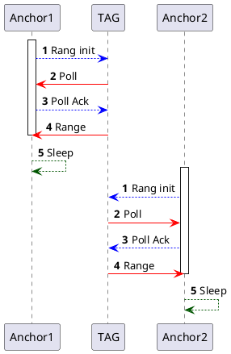
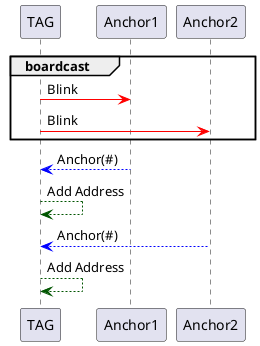
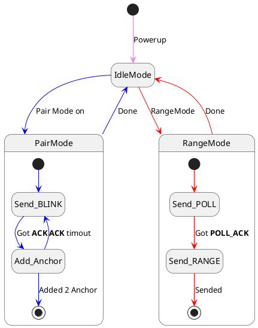

normal mode



pair mode



status machine Tag



status machine Anchor


TODO: We need to write the 12 octets for Minimum IEEE ID blink for DWM1000 MAC
**BLINK 都是自訂格式**
DWM1000 官方給的格式跟Arduino Library 都是自訂的

那我們自己可以為了不要撞在一起就用Frame Filter
但是就要符合 IEEE 802.15.4-2011 規定

BLINK package
```ditaa {cmd=true args=["-E"]}

+--------+----------+----------+----------+
| Frame  | Sequence |  TAG ID  |    FCS   |
| Control| Number   |          |          |
+--------+----------+----------+----------+
|  0xC5  | 1 octet  | 8 octets | 2 octets |
+--------+----------+----------+----------+
```

先確認Frame Filter ok
那就可以開始準備使用Frame Filter 進行流程管理

可以參考
int testapprun(instance_data_t *inst, int message, uint32 time_ms)
EVK1000